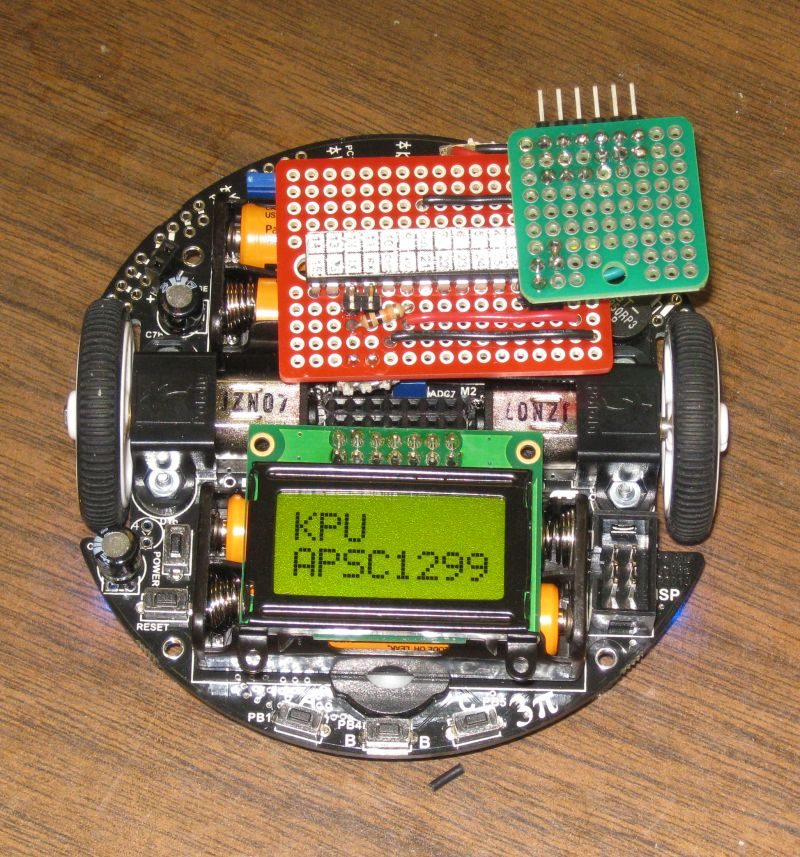

# Control 3Pi Robot

This C code for a PIC18F2620 to be used to test control of a Pololu 3Pi robot.
It is assumed the robot is running the serial slave program from Pololu.
This will allow the 3Pi robot to be controlled from the PIC via the serial lines.

* [10.a. Serial slave program](https://www.pololu.com/docs/0J21/all#10.a)

This image shows the 3Pi connected to a PIC18F2620 via the serial Tx and Rx lines.

Code update: Now also displays Battery Voltage in mV.

This is still in just a very early stage of development.